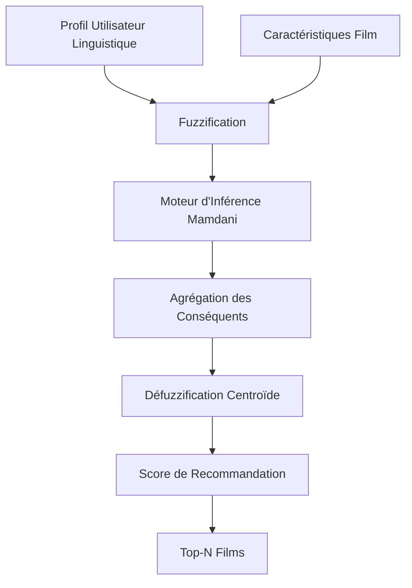
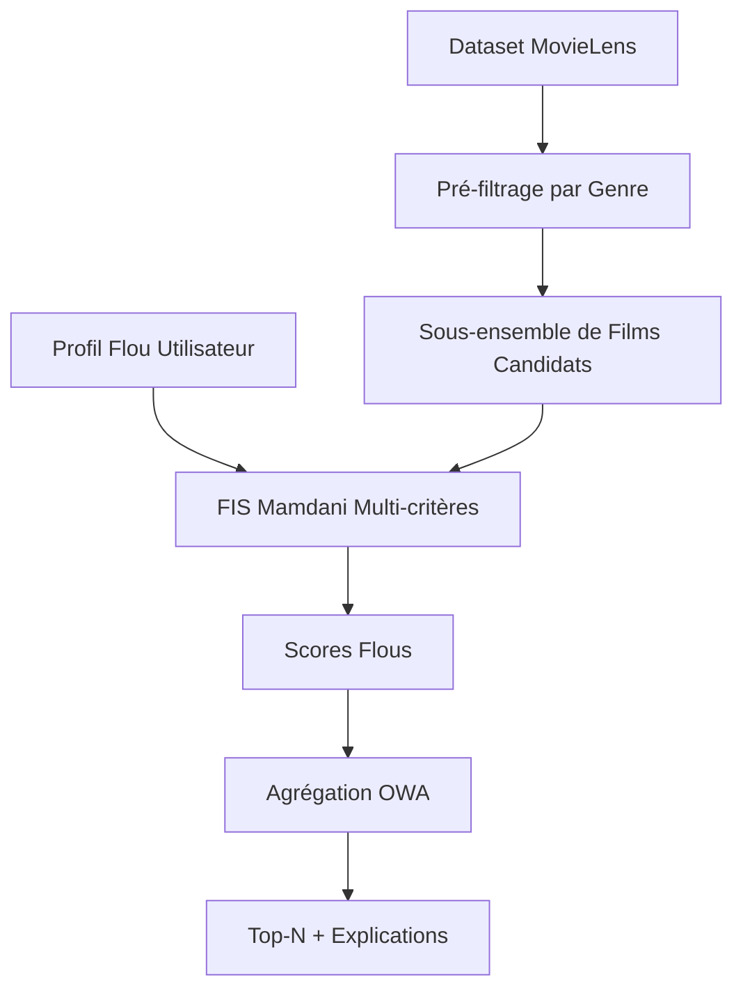
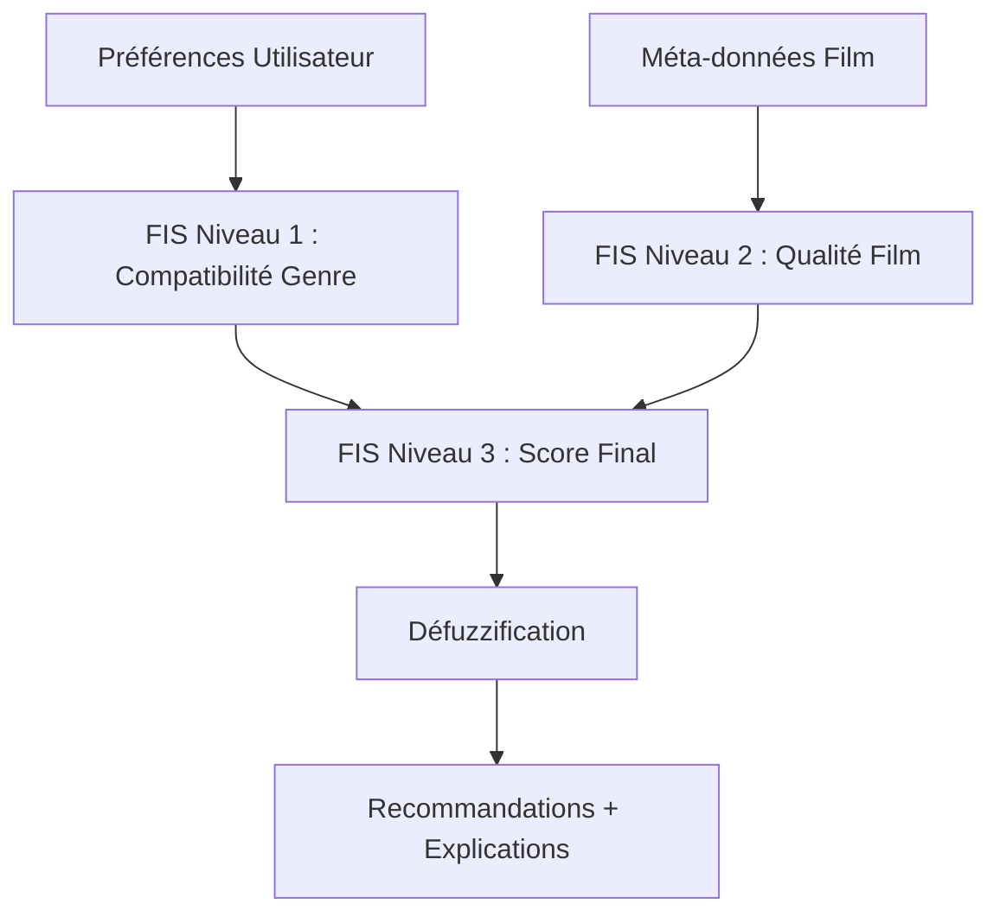
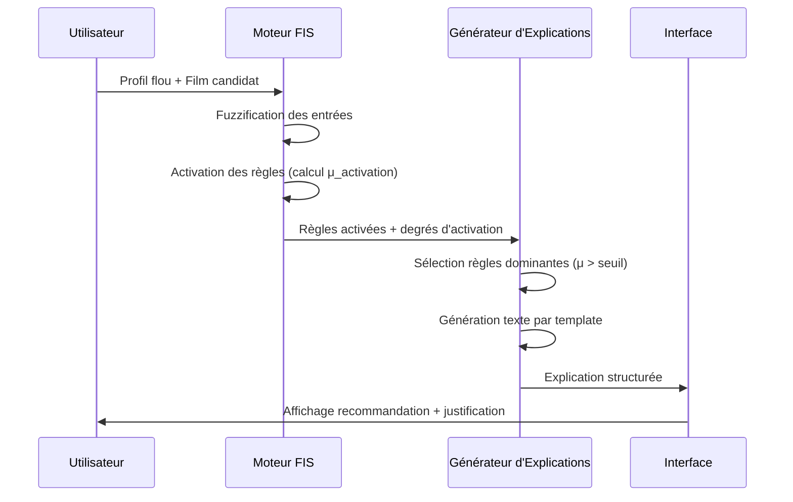
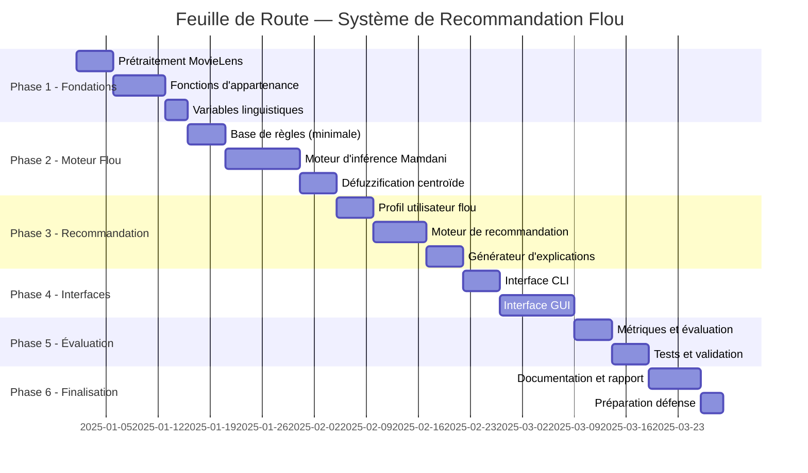

I have created the following plan after thorough exploration and analysis of the codebase. Follow the below plan verbatim. Trust the files and references. Do not re-verify what's written in the plan. Explore only when absolutely necessary. First implement all the proposed file changes and then I'll review all the changes together at the end.

# Plan Maître — Système de Recommandation Flou (Master IA — Logique Floue)

## Observations Clés

Le workspace contient déjà le dataset **MovieLens ml-latest-small** (`data/movie/`) avec 4 fichiers CSV : `ratings.csv`, `movies.csv`, `tags.csv`, `links.csv` — couvrant 9 742 films, 100 836 notes, 610 utilisateurs. Aucun code source n'existe encore. Le projet part de zéro. La version ml-latest-small est **idéale** : taille gérable, genres riches, tags utilisateurs exploitables comme préférences linguistiques floues, et liens IMDB/TMDB pour enrichissement optionnel.

## Approche Choisie

L'architecture retenue est un **Système d'Inférence Floue de type Mamdani pur**, organisé en couches modulaires (fuzzification → inférence → agrégation → défuzzification → explication). Ce choix maximise l'interprétabilité et la valeur pédagogique, tout en restant implémentable par des étudiants de Master. Python est sélectionné pour son écosystème scientifique.

---

## TÂCHE 1 — Stratégie de Recherche Scientifique

### Feuille de Route d'Apprentissage (ordre optimal)

| Ordre | Thème | Pourquoi Important | Ce qu'il faut comprendre | Livrable attendu |
|---|---|---|---|---|
| 1 | **Ensembles flous** | Fondation de tout le projet | Définition formelle $\mu_A: X \to [0,1]$, différence avec ensembles crisp | Fiche de synthèse + exemples dessinés |
| 2 | **Fonctions d'appartenance** | Modélisent les préférences imprécises | Triangulaire, trapézoïdale, gaussienne, sigmoïde — paramètres et choix | Bibliothèque de fonctions documentée |
| 3 | **Variables linguistiques** | Pont entre langage naturel et calcul | Définition de Zadeh, termes linguistiques, modificateurs (très, peu) | Dictionnaire de variables du projet |
| 4 | **Opérateurs flous** | Combiner les préférences | T-normes (min, produit), T-conormes (max, somme probabiliste), complément | Tableau comparatif des opérateurs |
| 5 | **Systèmes d'inférence floue** | Cœur du moteur de recommandation | Pipeline complet : fuzzification → règles → agrégation → défuzzification | Schéma du pipeline |
| 6 | **Modèle de Mamdani** | Interprétabilité maximale | Mécanisme d'inférence, agrégation des conséquents, défuzzification centroïde | Implémentation manuelle d'un FIS simple |
| 7 | **Modèle de Sugeno** | Comparaison critique | Conséquents fonctionnels, moyenne pondérée, différences avec Mamdani | Tableau comparatif Mamdani vs Sugeno |
| 8 | **Systèmes de recommandation** | Domaine d'application | Filtrage collaboratif, basé contenu, hybride — limites des approches classiques | Analyse critique des approches |
| 9 | **Aide à la décision floue** | Agrégation multi-critères | MCDM flou, agrégation OWA, pondération des critères | Modèle de décision documenté |
| 10 | **IA Explicable (XAI)** | Explicabilité des recommandations | Traçabilité des règles, contribution par critère, génération de texte | Prototype d'explication textuelle |

---

## TÂCHE 2 — Revue de Littérature Scientifique

### Articles Scientifiques Retenus

#### Article 1
- **Référence** : Yager, R.R. & Zadeh, L.A. (Eds.) (1992). *An Introduction to Fuzzy Logic Applications in Intelligent Systems*. Springer.
- **Objectif** : Poser les bases théoriques des systèmes flous appliqués à l'IA.
- **Méthodologie** : Théorie des ensembles flous, variables linguistiques, systèmes d'inférence.
- **Contributions** : Formalisation complète du raisonnement flou.
- **Limites** : Pas d'application directe aux systèmes de recommandation.
- **Intérêt** : Référence fondatrice pour justifier chaque choix de conception.

#### Article 2
- **Référence** : Yera, A. & Martínez, L. (2017). *Fuzzy Tools in Recommender Systems: A Survey*. International Journal of Computational Intelligence Systems, 10(1), 776–803. Atlantis Press.
- **Objectif** : Recenser l'usage de la logique floue dans les systèmes de recommandation.
- **Méthodologie** : Survey systématique de 2000 à 2016.
- **Contributions** : Taxonomie des approches floues en recommandation, identification des gaps.
- **Limites** : Ne couvre pas les approches post-2016.
- **Intérêt** : **Référence centrale** — justifie l'approche floue vs ML classique.

#### Article 3
- **Référence** : Bobadilla, J., Ortega, F., Hernando, A. & Gutiérrez, A. (2013). *Recommender systems survey*. Knowledge-Based Systems, 46, 109–132. Elsevier.
- **Objectif** : Vue d'ensemble des systèmes de recommandation.
- **Méthodologie** : Survey comparatif des méthodes classiques.
- **Contributions** : Métriques d'évaluation, comparaison des approches.
- **Limites** : Peu de place accordée aux approches floues.
- **Intérêt** : Fournit le contexte pour positionner notre approche floue.

#### Article 4
- **Référence** : Mamdani, E.H. & Assilian, S. (1975). *An experiment in linguistic synthesis with a fuzzy logic controller*. International Journal of Man-Machine Studies, 7(1), 1–13. Elsevier.
- **Objectif** : Proposer le premier système d'inférence floue linguistique.
- **Méthodologie** : Règles IF-THEN floues, défuzzification centroïde.
- **Contributions** : Modèle de Mamdani — fondement de notre moteur d'inférence.
- **Limites** : Coût computationnel de la défuzzification.
- **Intérêt** : **Référence obligatoire** pour justifier le choix de Mamdani.

#### Article 5
- **Référence** : Takagi, T. & Sugeno, M. (1985). *Fuzzy identification of systems and its applications to modeling and control*. IEEE Transactions on Systems, Man, and Cybernetics, 15(1), 116–132.
- **Objectif** : Proposer une alternative à Mamdani avec conséquents fonctionnels.
- **Méthodologie** : Conséquents linéaires, défuzzification par moyenne pondérée.
- **Contributions** : Modèle de Sugeno — référence pour la comparaison.
- **Limites** : Moins interprétable linguistiquement.
- **Intérêt** : Permet la comparaison rigoureuse Mamdani vs Sugeno (Tâche 7).

#### Article 6
- **Référence** : Isinkaye, F.O., Folajimi, Y.O. & Ojokoh, B.A. (2015). *Recommendation systems: Principles, methods and evaluation*. Egyptian Informatics Journal, 16(3), 261–273. Elsevier.
- **Objectif** : Évaluer les méthodes de recommandation.
- **Méthodologie** : Analyse comparative des métriques (Precision, Recall, RMSE).
- **Contributions** : Framework d'évaluation applicable à notre projet.
- **Limites** : Pas spécifique aux systèmes flous.
- **Intérêt** : Fournit les métriques d'évaluation (Tâche 14).

#### Article 7
- **Référence** : Zadeh, L.A. (1965). *Fuzzy sets*. Information and Control, 8(3), 338–353. Elsevier.
- **Objectif** : Introduire la théorie des ensembles flous.
- **Méthodologie** : Formalisation mathématique.
- **Contributions** : Fondement théorique absolu du projet.
- **Limites** : Aucune — article fondateur.
- **Intérêt** : **Citation obligatoire** dans tout rapport de logique floue.

### Lacunes Identifiées et Opportunités

| Lacune | Opportunité pour notre projet |
|---|---|
| Peu de systèmes flous avec explicabilité intégrée | Notre mécanisme d'explication par règles est une contribution originale |
| Rares implémentations sur MovieLens avec FIS pur | Positionnement clair et différenciant |
| Manque de visualisation des fonctions d'appartenance dans les RS | Interface graphique avec visualisation floue = valeur ajoutée |

---

## TÂCHE 3 — Formulation Formelle du Problème

### Définition Mathématique

**Entrées du système :**

$\mathbf{U} = \{u_1, u_2, \ldots, u_n\} \quad \text{(utilisateurs)}$
$\mathbf{M} = \{m_1, m_2, \ldots, m_k\} \quad \text{(films)}$

**Profil flou d'un utilisateur** $u$ :

$P(u) = \{(\text{genre}_i, \tilde{\mu}_i) \mid i = 1, \ldots, G\}$

où $\tilde{\mu}_i \in [0,1]$ est le degré d'appartenance flou de la préférence pour le genre $i$, exprimé linguistiquement.

**Vecteur de caractéristiques floues d'un film** $m$ :

$F(m) = (\tilde{g}, \tilde{r}, \tilde{p}, \tilde{a}, \tilde{d})$

où :
- $\tilde{g}$ = appartenance aux genres (vecteur)
- $\tilde{r}$ = note floue (rating)
- $\tilde{p}$ = popularité floue
- $\tilde{a}$ = ancienneté floue
- $\tilde{d}$ = durée floue

**Score de recommandation flou :**

$\text{Score}(u, m) = \text{FIS}(P(u), F(m)) \in [0, 1]$

**Sortie :** Liste ordonnée $\text{Top-N}(u) = \{m \mid \text{Score}(u,m) \geq \theta\}$

### Où se situe l'incertitude

```
Préférence utilisateur : "J'aime beaucoup la Sci-Fi"
                              ↓
         Incertitude sémantique : que signifie "beaucoup" ?
                              ↓
         Modélisation floue : μ_beaucoup(x) = trapèze(0.7, 0.85, 1.0, 1.0)
```

### Comparaison des Approches

| Critère | Règles Classiques | Filtrage Collaboratif | Filtrage Contenu | ML/DL | **Logique Floue** |
|---|---|---|---|---|---|
| Préférences imprécises | ✗ | ✗ | ✗ | Partiel | **✓** |
| Explicabilité | Partielle | ✗ | Partielle | ✗ | **✓** |
| Cold start | ✗ | ✗ | ✓ | ✗ | **✓** |
| Données requises | Peu | Beaucoup | Moyenne | Beaucoup | **Peu** |
| Raisonnement linguistique | ✗ | ✗ | ✗ | ✗ | **✓** |

---

## TÂCHE 4 — Architectures Proposées

### Architecture A — FIS Pur (Mamdani Monolithique)



- **Complexité** : Faible
- **Avantages** : Logique floue pure, très pédagogique, explicable
- **Inconvénients** : Scalabilité limitée, pas de personnalisation dynamique

### Architecture B — FIS Hybride avec Pré-filtrage



- **Complexité** : Moyenne
- **Avantages** : Performant, logique floue centrale, scalable
- **Inconvénients** : Le pré-filtrage peut exclure des films pertinents

### Architecture C — FIS en Couches (Hiérarchique)



- **Complexité** : Élevée
- **Avantages** : Modularité maximale, extensible
- **Inconvénients** : Complexité de calibration, risque de propagation d'erreurs

### Recommandation : **Architecture B**

L'Architecture B est recommandée car elle maintient la logique floue comme moteur central tout en restant réalisable. Le pré-filtrage par genre est une étape crisp simple qui réduit l'espace de recherche, et le FIS Mamdani multi-critères constitue le cœur scientifique démontrable.

---

## TÂCHE 5 — Conception du Modèle Flou

### Variables Linguistiques — Définition Complète

#### Variable 1 : Préférence Utilisateur par Genre
- **Domaine** : Expression linguistique de l'utilisateur
- **Univers de discours** : $X = [0, 1]$
- **Termes** : {`Faible`, `Moyenne`, `Forte`}
- **Fonctions d'appartenance** :

| Terme | Type | Paramètres |
|---|---|---|
| `Faible` | Trapézoïdale | (0, 0, 0.2, 0.45) |
| `Moyenne` | Triangulaire | (0.3, 0.5, 0.7) |
| `Forte` | Trapézoïdale | (0.55, 0.8, 1.0, 1.0) |

- **Justification** : Les trapèzes aux extrêmes capturent les cas "absolument pas" et "totalement", le triangle central modélise l'ambiguïté maximale.

#### Variable 2 : Note Moyenne du Film (Rating)
- **Domaine** : Moyenne des notes MovieLens
- **Univers de discours** : $X = [0.5, 5.0]$
- **Termes** : {`Mauvaise`, `Correcte`, `Bonne`, `Excellente`}

| Terme | Type | Paramètres (sur [0.5, 5.0]) |
|---|---|---|
| `Mauvaise` | Trapézoïdale | (0.5, 0.5, 1.5, 2.5) |
| `Correcte` | Triangulaire | (2.0, 3.0, 3.8) |
| `Bonne` | Triangulaire | (3.2, 3.8, 4.5) |
| `Excellente` | Trapézoïdale | (4.0, 4.5, 5.0, 5.0) |

#### Variable 3 : Popularité du Film
- **Domaine** : Nombre de notes reçues (dérivé de `ratings.csv`)
- **Univers de discours** : $X = [0, 350]$ (normalisé sur le dataset)
- **Termes** : {`Confidentiel`, `Modéré`, `Populaire`, `Très Populaire`}

| Terme | Type | Paramètres |
|---|---|---|
| `Confidentiel` | Trapézoïdale | (0, 0, 10, 30) |
| `Modéré` | Triangulaire | (20, 60, 120) |
| `Populaire` | Triangulaire | (80, 150, 250) |
| `Très Populaire` | Trapézoïdale | (200, 280, 350, 350) |

#### Variable 4 : Ancienneté du Film
- **Domaine** : Année de sortie (extraite du titre dans `movies.csv`)
- **Univers de discours** : $X = [1900, 2018]$
- **Termes** : {`Classique`, `Ancien`, `Récent`, `Très Récent`}

| Terme | Type | Paramètres |
|---|---|---|
| `Classique` | Trapézoïdale | (1900, 1900, 1970, 1985) |
| `Ancien` | Triangulaire | (1975, 1990, 2005) |
| `Récent` | Triangulaire | (2000, 2008, 2015) |
| `Très Récent` | Trapézoïdale | (2012, 2016, 2018, 2018) |

#### Variable 5 : Score de Recommandation (Sortie)
- **Univers de discours** : $X = [0, 1]$
- **Termes** : {`Très Faible`, `Faible`, `Moyen`, `Fort`, `Très Fort`}

| Terme | Type | Paramètres |
|---|---|---|
| `Très Faible` | Trapézoïdale | (0, 0, 0.1, 0.25) |
| `Faible` | Triangulaire | (0.15, 0.3, 0.45) |
| `Moyen` | Triangulaire | (0.35, 0.5, 0.65) |
| `Fort` | Triangulaire | (0.55, 0.7, 0.85) |
| `Très Fort` | Trapézoïdale | (0.75, 0.9, 1.0, 1.0) |

---

## TÂCHE 6 — Base de Règles Floues

### Version Minimale (8 règles — démonstration de base)

```
R1: IF préférence_genre IS Forte AND note IS Excellente THEN score IS Très_Fort
R2: IF préférence_genre IS Forte AND note IS Bonne THEN score IS Fort
R3: IF préférence_genre IS Moyenne AND note IS Excellente THEN score IS Fort
R4: IF préférence_genre IS Moyenne AND note IS Bonne THEN score IS Moyen
R5: IF préférence_genre IS Faible AND note IS Excellente THEN score IS Moyen
R6: IF préférence_genre IS Faible AND note IS Bonne THEN score IS Faible
R7: IF préférence_genre IS Forte AND note IS Mauvaise THEN score IS Faible
R8: IF préférence_genre IS Faible AND note IS Mauvaise THEN score IS Très_Faible
```

### Version Intermédiaire (20 règles — ajout popularité)

Étend la version minimale en intégrant la popularité comme troisième antécédent :

```
R9:  IF préférence_genre IS Forte AND note IS Excellente AND popularité IS Très_Populaire THEN score IS Très_Fort
R10: IF préférence_genre IS Forte AND note IS Excellente AND popularité IS Confidentiel THEN score IS Fort
R11: IF préférence_genre IS Moyenne AND popularité IS Très_Populaire AND note IS Bonne THEN score IS Fort
R12: IF préférence_genre IS Faible AND popularité IS Très_Populaire AND note IS Excellente THEN score IS Moyen
... (jusqu'à 20 règles couvrant les combinaisons critiques)
```

### Version Avancée (35–45 règles — ajout ancienneté + préférence récence)

Intègre l'ancienneté et la préférence de l'utilisateur pour les films récents :

```
R21: IF préférence_genre IS Forte AND note IS Excellente AND ancienneté IS Très_Récent AND préférence_récence IS Forte THEN score IS Très_Fort
R22: IF préférence_genre IS Forte AND note IS Excellente AND ancienneté IS Classique AND préférence_récence IS Forte THEN score IS Moyen
R23: IF préférence_genre IS Forte AND ancienneté IS Classique AND préférence_récence IS Faible THEN score IS Fort
... (jusqu'à 45 règles)
```

### Analyse des Interactions

| Situation | Règles en conflit | Résolution |
|---|---|---|
| Genre fort + Note mauvaise | R2 vs R7 | Agrégation max des conséquents (Mamdani) |
| Film populaire mais genre non aimé | R12 vs R6 | La préférence genre prime (pondération) |
| Film classique + préférence récence forte | R22 | Règle explicite de pénalisation |

**Configuration recommandée** : Version intermédiaire (20 règles) pour la démonstration, avec possibilité d'activer la version avancée via configuration.

---

## TÂCHE 7 — Choix du Moteur d'Inférence

### Comparaison Mamdani vs Sugeno

| Critère | Mamdani | Sugeno |
|---|---|---|
| **Conséquents** | Ensembles flous linguistiques | Fonctions constantes ou linéaires |
| **Défuzzification** | Centroïde (coûteuse) | Moyenne pondérée (rapide) |
| **Interprétabilité** | ✓✓✓ Maximale | ✓ Partielle |
| **Explicabilité** | ✓✓✓ Naturelle en langage | ✓ Mathématique |
| **Coût computationnel** | Moyen | Faible |
| **Adaptation RS** | ✓✓✓ Idéal | ✓✓ Bon |
| **Valeur pédagogique** | ✓✓✓ Maximale | ✓✓ Bonne |
| **Implémentation étudiants** | ✓✓✓ Directe | ✓✓ Directe |

### Décision : **Mamdani**

**Justification scientifique** : Le modèle de Mamdani (Mamdani & Assilian, 1975) produit des conséquents linguistiques qui correspondent directement aux termes utilisés dans les explications ("score Fort", "score Très Fort"). Cette propriété est fondamentale pour l'explicabilité. La défuzzification par centroïde, bien que plus coûteuse, reste parfaitement acceptable pour un dataset de 9 742 films. Sugeno serait préférable uniquement si la performance computationnelle était critique, ce qui n'est pas le cas ici.

---

## TÂCHE 8 — Mécanisme d'Explicabilité

### Architecture d'Explication



### Format d'Explication Structurée

```
Film : Interstellar (2014)
Score de recommandation : 0.87 → "Très Fort"

Pourquoi ce film vous est recommandé :
━━━━━━━━━━━━━━━━━━━━━━━━━━━━━━━━━━━━
✓ Votre intérêt pour la Science-Fiction est FORT (μ = 0.85)
✓ La note du film est EXCELLENTE (μ = 0.92, moyenne = 4.2/5)
✓ Sa popularité est TRÈS POPULAIRE (μ = 0.78, 341 notes)
✓ Le film est TRÈS RÉCENT selon vos préférences (μ = 0.71, 2014)

Règles floues activées :
  R9 [μ=0.78] : SI genre=Fort ET note=Excellente ET popularité=Très_Populaire → Très_Fort
  R21 [μ=0.71] : SI genre=Fort ET note=Excellente ET récence=Très_Récent → Très_Fort

Défuzzification (centroïde) : 0.87
━━━━━━━━━━━━━━━━━━━━━━━━━━━━━━━━━━━━
```

### Implémentation du Générateur d'Explications

Le module `ExplanationEngine` doit :
1. Capturer les degrés d'activation de chaque règle pendant l'inférence
2. Filtrer les règles avec $\mu_{activation} > 0.1$ (seuil configurable)
3. Identifier le terme linguistique dominant pour chaque variable d'entrée
4. Remplir des templates textuels paramétrés par les termes linguistiques
5. Calculer la contribution relative de chaque critère au score final

---

## TÂCHE 9 — Architecture Logicielle

### Choix Technologique : **Python**

| Critère | Python | Java | C# | JavaScript |
|---|---|---|---|---|
| Bibliothèques scientifiques | ✓✓✓ | ✓ | ✓ | ✗ |
| Visualisation (matplotlib) | ✓✓✓ | ✗ | ✗ | ✓✓ |
| Traitement données (pandas) | ✓✓✓ | ✗ | ✗ | ✗ |
| Implémentation FIS manuelle | ✓✓✓ | ✓✓ | ✓✓ | ✗ |
| Familiarité étudiants Master IA | ✓✓✓ | ✓✓ | ✓ | ✓ |
| Interface graphique (tkinter/PyQt) | ✓✓ | ✓✓✓ | ✓✓✓ | N/A |

**Bibliothèques Python retenues** (à vérifier dans `requirements.txt` à créer) :
- `pandas` — chargement et traitement MovieLens
- `numpy` — calculs numériques des fonctions d'appartenance
- `matplotlib` / `plotly` — visualisation des fonctions d'appartenance
- `PyQt5` ou `tkinter` — interface graphique (à décider selon préférence équipe)
- `click` ou `argparse` — interface CLI
- `loguru` ou `logging` — journalisation
- `pytest` — tests unitaires
- `scikit-fuzzy` — **uniquement comme référence de validation**, le FIS doit être implémenté manuellement

### Organisation du Code

```
Logique_Floue/
├── data/
│   └── movie/                    # Dataset MovieLens (existant)
│       ├── movies.csv
│       ├── ratings.csv
│       ├── tags.csv
│       └── links.csv
├── src/
│   ├── fuzzy/                    # Cœur scientifique flou
│   │   ├── membership.py         # Fonctions d'appartenance (triangulaire, trapézoïdale, gaussienne)
│   │   ├── linguistic_vars.py    # Définition des variables linguistiques
│   │   ├── rule_base.py          # Base de règles floues
│   │   ├── inference_engine.py   # Moteur d'inférence Mamdani
│   │   ├── aggregation.py        # Agrégation des conséquents
│   │   └── defuzzification.py    # Défuzzification (centroïde, bisecteur)
│   ├── data/
│   │   ├── loader.py             # Chargement MovieLens
│   │   ├── preprocessor.py       # Prétraitement et dérivation d'attributs
│   │   └── movie_repository.py   # Accès aux données films
│   ├── recommender/
│   │   ├── user_profile.py       # Modèle de profil utilisateur flou
│   │   ├── fuzzy_recommender.py  # Moteur de recommandation principal
│   │   └── explanation_engine.py # Génération d'explications
│   ├── ui/
│   │   ├── gui/                  # Interface graphique
│   │   │   ├── main_window.py
│   │   │   ├── preferences_editor.py
│   │   │   ├── recommendations_view.py
│   │   │   └── explanation_view.py
│   │   └── cli/                  # Interface ligne de commande
│   │       └── commands.py
│   └── evaluation/
│       ├── metrics.py            # Precision, Recall, Coverage, Diversité
│       └── evaluator.py          # Évaluateur du système
├── tests/
│   ├── test_membership.py
│   ├── test_inference.py
│   ├── test_recommender.py
│   └── test_explanation.py
├── config/
│   └── fuzzy_config.yaml         # Paramètres des fonctions d'appartenance et règles
├── docs/
│   └── rapport/                  # Rapport scientifique
├── requirements.txt
├── main.py                       # Point d'entrée (GUI ou CLI)
└── README.md
```

### Prétraitement du Dataset MovieLens

**Attributs disponibles** dans `ml-latest-small` :

| Fichier | Attributs | Utilisation |
|---|---|---|
| `movies.csv` | movieId, title, genres | Genres → préférence floue ; année extraite du titre |
| `ratings.csv` | userId, movieId, rating, timestamp | Note moyenne → variable floue ; nb notes → popularité |
| `tags.csv` | userId, movieId, tag, timestamp | Tags → enrichissement sémantique optionnel |
| `links.csv` | movieId, imdbId, tmdbId | Enrichissement TMDB (durée, poster) — optionnel |

**Attributs dérivés à calculer** dans `preprocessor.py` :

| Attribut Dérivé | Source | Calcul |
|---|---|---|
| `avg_rating` | `ratings.csv` | Moyenne des notes par film |
| `num_ratings` | `ratings.csv` | Comptage des notes par film (→ popularité) |
| `release_year` | `movies.csv` (titre) | Extraction regex `\((\d{4})\)` |
| `genre_list` | `movies.csv` | Split sur `|` |
| `genre_vector` | `movies.csv` | Encodage binaire des 19 genres |

**Attributs manquants** (non disponibles dans ml-latest-small) :
- Durée du film → à récupérer via API TMDB (optionnel, extension future)
- Données démographiques utilisateurs → absentes par design (anonymisation)
- Synopsis → absent (extension future via TMDB)

---

## TÂCHE 10 — Conception de l'Interface Utilisateur

### Wireframes des Écrans Principaux

#### Écran 1 — Page d'Accueil
```
┌─────────────────────────────────────────────────────────┐
│  🎬 FuzzyRec                          [Profil] [Aide]   │
├─────────────────────────────────────────────────────────┤
│                                                         │
│   "Vos recommandations intelligentes"                   │
│   Basées sur vos préférences, même imprécises           │
│                                                         │
│   [🔍 Rechercher un film...]                            │
│                                                         │
│   ── Recommandé pour vous ──────────────────────────    │
│   [Film 1 ★4.2] [Film 2 ★3.9] [Film 3 ★4.5] [...]     │
│                                                         │
│   ── Tendances ─────────────────────────────────────    │
│   [Film A] [Film B] [Film C] [Film D] [Film E]          │
│                                                         │
│   [⚙️ Modifier mes préférences]                         │
└─────────────────────────────────────────────────────────┘
```

#### Écran 2 — Éditeur de Préférences Floues
```
┌─────────────────────────────────────────────────────────┐
│  ⚙️ Mes Préférences                          [Sauver]   │
├─────────────────────────────────────────────────────────┤
│  Genres                                                 │
│  Action      [━━━━━━━━━━━━━━━━━━━━━━━━━━━━━━━━━━━━━━━] │
│              Pas du tout  Un peu  Moyennement  Beaucoup │
│                                                         │
│  Science-Fiction [━━━━━━━━━━━━━━━━━━━━━━━━━━━━━━━━━━━] │
│  Horreur     [━━━━━━━━━━━━━━━━━━━━━━━━━━━━━━━━━━━━━━━] │
│  Comédie     [━━━━━━━━━━━━━━━━━━━━━━━━━━━━━━━━━━━━━━━] │
│  Drame       [━━━━━━━━━━━━━━━━━━━━━━━━━━━━━━━━━━━━━━━] │
│                                                         │
│  Critères Généraux                                      │
│  Préférence récence  [━━━━━━━━━━━━━━━━━━━━━━━━━━━━━━━] │
│  Importance popularité [━━━━━━━━━━━━━━━━━━━━━━━━━━━━━] │
│                                                         │
│  [📊 Voir mes fonctions d'appartenance]                 │
└─────────────────────────────────────────────────────────┘
```

#### Écran 3 — Explication de Recommandation
```
┌─────────────────────────────────────────────────────────┐
│  🎬 Interstellar (2014)              Score: ████████ 87%│
├─────────────────────────────────────────────────────────┤
│  Pourquoi ce film vous est recommandé :                 │
│                                                         │
│  ✅ Science-Fiction    FORT      ████████░░  μ=0.85     │
│  ✅ Note du film       EXCELLENTE █████████░  μ=0.92    │
│  ✅ Popularité         TRÈS POP.  ████████░░  μ=0.78    │
│  ✅ Récence            TRÈS RÉCENT ███████░░░  μ=0.71   │
│                                                         │
│  Règles activées :                                      │
│  R9  [0.78] Genre=Fort ∧ Note=Excellente ∧ Pop=Très_Pop│
│  R21 [0.71] Genre=Fort ∧ Note=Excellente ∧ Récent      │
│                                                         │
│  [📈 Voir les fonctions d'appartenance]  [← Retour]    │
└─────────────────────────────────────────────────────────┘
```

### Recommandations UX/UI

- **Sliders linguistiques** : Étiquettes textuelles ("Pas du tout", "Un peu", "Moyennement", "Beaucoup") plutôt que valeurs numériques — renforce le paradigme flou
- **Visualisation des fonctions d'appartenance** : Graphique matplotlib intégré montrant la position de la valeur courante sur la courbe
- **Barres de score colorées** : Gradient vert pour les scores élevés, rouge pour les faibles
- **Mode "Pourquoi ?" accessible** : Bouton sur chaque carte film pour afficher l'explication

---

## TÂCHE 11 — Mode Ligne de Commande (CLI)

### Commandes Principales

```bash
# Obtenir des recommandations pour un utilisateur
python main.py recommend --user-id 42 --top-n 10 --explain

# Afficher/modifier le profil flou d'un utilisateur
python main.py profile --user-id 42 --show
python main.py profile --user-id 42 --set-genre "Sci-Fi=0.9,Action=0.4"

# Gérer les préférences linguistiques
python main.py preferences --user-id 42 --genre "Science-Fiction" --level "beaucoup"
python main.py preferences --user-id 42 --recency "récent" --popularity "élevée"

# Évaluer le système
python main.py evaluate --metric precision --top-n 10
python main.py evaluate --metric all --output results.json

# Statistiques du dataset
python main.py dataset-stats --show-genres --show-ratings-dist

# Visualiser les fonctions d'appartenance
python main.py visualize --variable rating --save membership_rating.png

# Tester le moteur d'inférence
python main.py infer --genre-pref 0.85 --rating 4.2 --popularity 250 --explain
```

### Options Globales

```bash
--config config/fuzzy_config.yaml   # Fichier de configuration
--rules intermediate                # Version des règles (minimal/intermediate/advanced)
--output-format json|text|table     # Format de sortie
--verbose                           # Mode verbeux (affiche les calculs flous)
--log-level DEBUG|INFO|WARNING      # Niveau de journalisation
```

---

## TÂCHE 12 — Feuille de Route de Développement



### Détail des Phases

| Phase | Objectif | Livrables | Dépendances | Risques | Charge |
|---|---|---|---|---|---|
| **1 — Fondations** | Données + FIS de base | `loader.py`, `preprocessor.py`, `membership.py`, `linguistic_vars.py` | Aucune | Dataset incomplet | 3 semaines |
| **2 — Moteur Flou** | FIS Mamdani fonctionnel | `rule_base.py`, `inference_engine.py`, `defuzzification.py` | Phase 1 | Bugs d'inférence | 3 semaines |
| **3 — Recommandation** | Système complet | `user_profile.py`, `fuzzy_recommender.py`, `explanation_engine.py` | Phase 2 | Qualité des recommandations | 2 semaines |
| **4 — Interfaces** | GUI + CLI | `commands.py`, `main_window.py`, vues GUI | Phase 3 | Complexité GUI | 2 semaines |
| **5 — Évaluation** | Validation scientifique | `metrics.py`, `evaluator.py`, rapport d'évaluation | Phase 4 | Métriques inadaptées | 1 semaine |
| **6 — Finalisation** | Défense prête | Documentation, rapport, démo | Phase 5 | Manque de temps | 1 semaine |

---

## TÂCHE 13 — Stratégie de Test

### Tests Unitaires — Composants Critiques

| Module | Ce qui est testé | Méthode de validation |
|---|---|---|
| `membership.py` | `triangular(x, a, b, c)` | Vérifier $\mu(a)=0$, $\mu(b)=1$, $\mu(c)=0$, $\mu \in [0,1]$ |
| `membership.py` | `trapezoidal(x, a, b, c, d)` | Vérifier plateau, pentes, bornes |
| `inference_engine.py` | Activation d'une règle | Vérifier $\mu_{activation} = \min(\mu_{ant1}, \mu_{ant2})$ |
| `aggregation.py` | Agrégation de conséquents | Vérifier $\mu_{agg} = \max(\mu_{R1}, \mu_{R2}, ...)$ |
| `defuzzification.py` | Centroïde | Vérifier résultat sur cas analytique connu |
| `fuzzy_recommender.py` | Score final | Vérifier cohérence : préférence forte + note excellente → score élevé |
| `explanation_engine.py` | Génération d'explication | Vérifier présence des termes linguistiques corrects |

### Tests d'Intégration

- Pipeline complet : profil utilisateur → FIS → score → explication
- Cohérence entre CLI et GUI (mêmes résultats pour mêmes entrées)
- Chargement et prétraitement complet du dataset

### Validation Scientifique des Composants Flous

- **Test de monotonie** : Si la préférence genre augmente, le score doit augmenter (toutes choses égales)
- **Test de symétrie** : Deux films identiques doivent obtenir le même score
- **Test de sensibilité** : Variation de $\pm 0.1$ sur une entrée → variation proportionnelle du score
- **Test de couverture des règles** : Vérifier qu'aucune combinaison d'entrées ne produit un score nul par absence de règle

---

## TÂCHE 14 — Méthodologie d'Évaluation

### Métriques Quantitatives

| Métrique | Formule | Interprétation |
|---|---|---|
| **Precision@N** | $\frac{\|relevant \cap recommended\|}{N}$ | Proportion de recommandations pertinentes |
| **Recall@N** | $\frac{\|relevant \cap recommended\|}{\|relevant\|}$ | Proportion de films pertinents retrouvés |
| **Coverage** | $\frac{\|films\_recommandés\|}{\|films\_total\|}$ | Diversité du catalogue couvert |
| **Diversité** | $1 - \frac{1}{N(N-1)}\sum_{i \neq j} sim(m_i, m_j)$ | Variété des recommandations |
| **Score moyen flou** | Moyenne des scores FIS sur Top-N | Confiance du système |

### Évaluation de l'Explicabilité

- **Complétude** : Toutes les règles activées sont-elles mentionnées ?
- **Précision linguistique** : Les termes utilisés correspondent-ils aux degrés calculés ?
- **Lisibilité** : Évaluation qualitative par des utilisateurs tests

### Protocole d'Évaluation

1. Diviser les utilisateurs en 80% train / 20% test
2. Masquer les notes du jeu de test
3. Générer les recommandations Top-10 avec le FIS
4. Comparer avec les notes réelles (note ≥ 4.0 = pertinent)
5. Calculer Precision@10, Recall@10, Coverage, Diversité
6. Comparer avec une baseline (recommandation par popularité seule)

---

## TÂCHE 15 — Analyse des Risques

| Risque | Catégorie | Probabilité | Impact | Stratégie d'Atténuation |
|---|---|---|---|---|
| Base de règles incohérente (conflits non résolus) | Scientifique | Moyenne | Élevé | Tester chaque règle individuellement ; utiliser l'agrégation max de Mamdani |
| Fonctions d'appartenance mal calibrées | Scientifique | Élevée | Élevé | Visualiser systématiquement ; valider sur cas connus |
| Dataset sans durée des films | Dataset | Certaine | Faible | Exclure la variable durée de la version de base ; extension TMDB optionnelle |
| Performance insuffisante sur 9742 films | Technique | Faible | Moyen | Pré-filtrage par genre avant FIS ; optimisation numpy |
| Interface GUI trop complexe à développer | Développement | Moyenne | Moyen | Prioriser CLI ; GUI en phase finale |
| Métriques d'évaluation inadaptées au FIS | Scientifique | Moyenne | Moyen | Utiliser métriques standard RS + métriques floues spécifiques |
| Difficulté à expliquer le FIS lors de la défense | Défense | Faible | Élevé | Préparer visualisations des fonctions d'appartenance et des règles activées |
| Dérive vers du ML classique | Scientifique | Faible | Très Élevé | Revue hebdomadaire : chaque composant doit avoir une justification floue |
| Manque de temps pour la version avancée des règles | Développement | Moyenne | Faible | Version intermédiaire (20 règles) est suffisante pour la défense |

---

## Données MovieLens — Recommandation Finale

**Version recommandée : `ml-latest-small`** (déjà présente dans le workspace)

**Justification** : 9 742 films et 100 836 notes constituent un volume idéal — suffisant pour des recommandations significatives, mais assez petit pour que le FIS s'exécute en temps réel lors de la démonstration. Les 19 genres disponibles couvrent parfaitement les variables linguistiques de préférence. Les tags utilisateurs peuvent enrichir le profil flou de manière optionnelle.