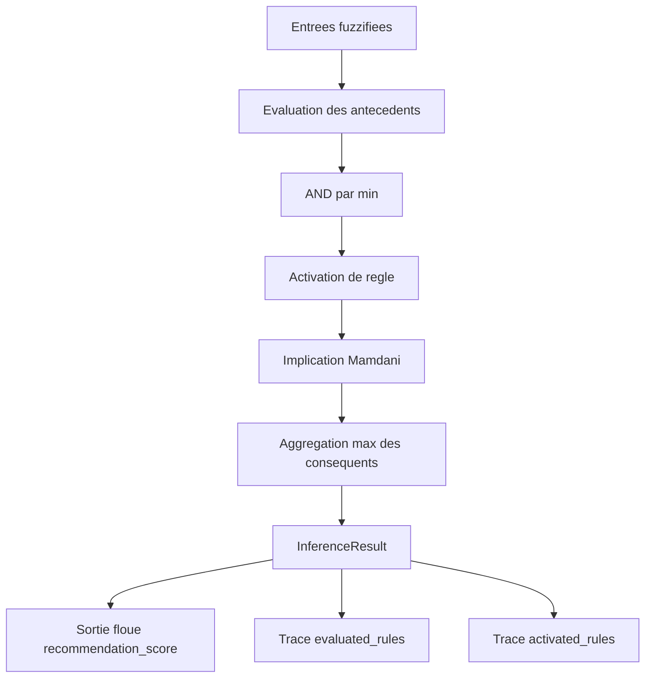
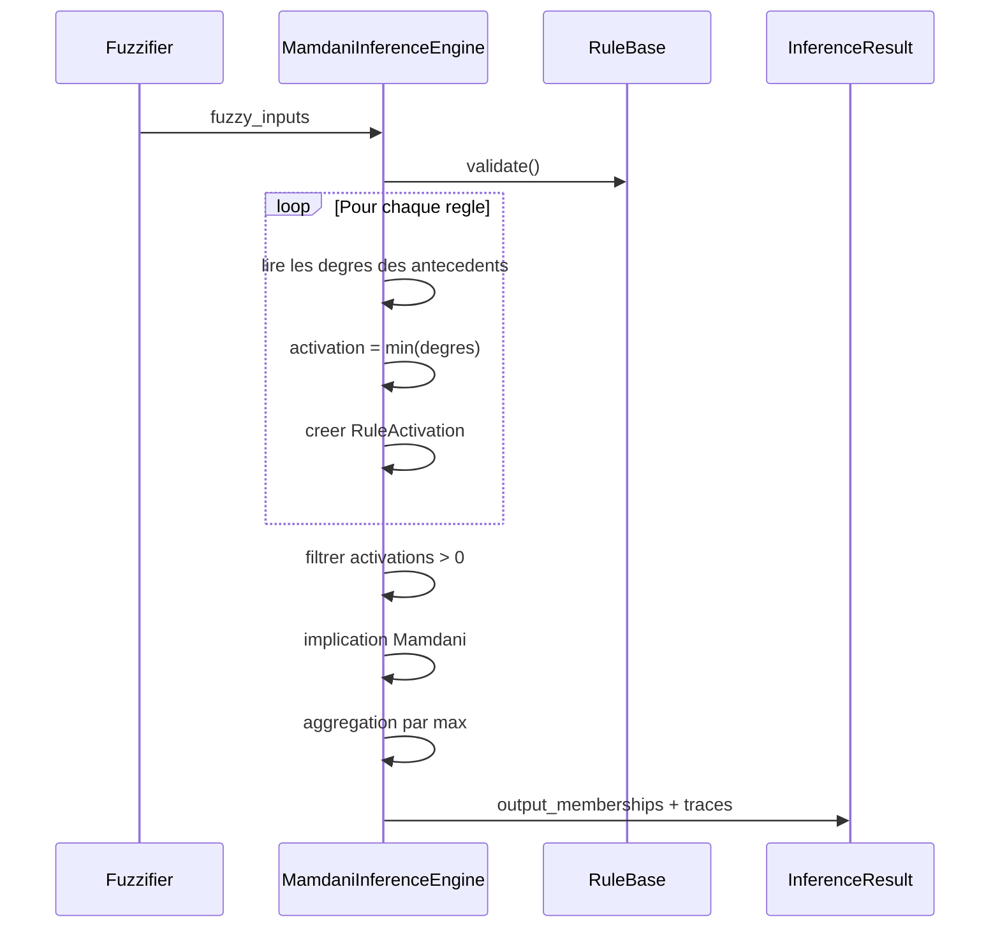

# Moteur d'inference Mamdani

Date : 2026-06-05

## Objectif

Ce document decrit l'etape d'inference Mamdani implementee dans
`src/fuzzy/inference_engine.py`. Le moteur transforme des entrees deja
fuzzifiees en sortie floue agregee sur `recommendation_score`.

La defuzzification n'est pas encore appliquee : `crisp_score` reste donc `None`
dans `InferenceResult`.

## Pipeline



## Activation d'une regle

Pour une regle :

```text
IF genre_preference IS forte
AND average_rating IS excellente
AND popularity IS tres_populaire
THEN recommendation_score IS tres_fort
```

Le moteur lit les degres d'appartenance :

```text
mu_genre_preference.forte
mu_average_rating.excellente
mu_popularity.tres_populaire
```

Puis applique la t-norme min :

```text
activation(R) = min(mu_1, mu_2, mu_3)
```

## Implication Mamdani

L'implication Mamdani coupe le consequent au degre d'activation de la regle.
Dans l'etat actuel du projet, la sortie est encore symbolique :

```text
R1 active a 0.7
=> recommendation_score.tres_fort = 0.7
```

La forme continue de la fonction de sortie sera exploitee a l'etape de
defuzzification.

## Aggregation max

Si plusieurs regles activent le meme terme de sortie, le moteur conserve le
maximum :

```text
R2 => recommendation_score.fort = 0.6
R3 => recommendation_score.fort = 0.4

aggregation_max(fort) = max(0.6, 0.4) = 0.6
```

## Sequence de calcul



## Structures produites

`RuleActivation` contient :

- la regle ;
- le degre d'activation ;
- les degres lus pour chaque antecedent ;
- un indicateur `is_active` ;
- le terme consequent active.

`InferenceResult` contient :

- `crisp_score = None` tant que la defuzzification n'est pas appliquee ;
- `output_memberships` : termes de sortie agreges ;
- `activated_rules` : regles avec degre strictement positif ;
- `evaluated_rules` : trace complete des 8 regles ;
- `output_variable = recommendation_score`.

## Exemple

Entrees :

```text
genre_preference.forte = 0.7
average_rating.excellente = 0.9
popularity.tres_populaire = 0.8
```

Regle R1 :

```text
activation = min(0.7, 0.9, 0.8) = 0.7
recommendation_score.tres_fort = 0.7
```

Sortie :

```text
output_memberships = {"tres_fort": 0.7}
```
