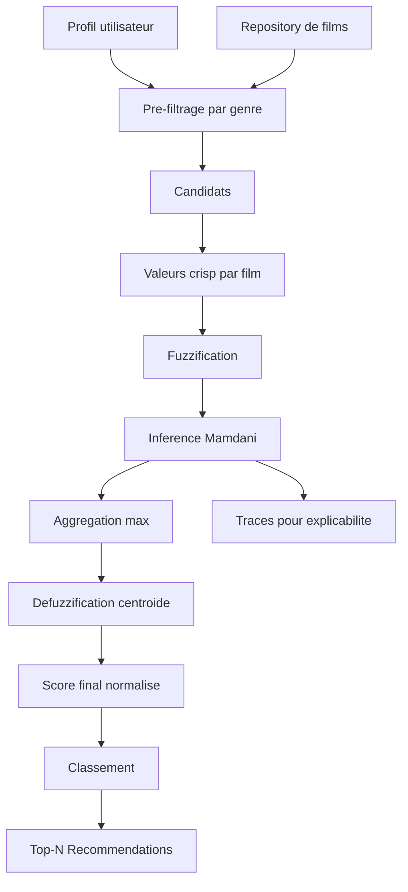

# Pipeline de recommandation floue V1

Date : 2026-06-05

## Objectif

Le pipeline V1 transforme un profil utilisateur flou et des caracteristiques de
films MovieLens en recommandations Top-N interpretable et tracables.

## Pipeline cible implemente

## Etapes

### 1. Pre-filtrage

`FuzzyRecommender.prefilter_candidates` extrait les genres preferes du profil
utilisateur avec un seuil par defaut de `0.5`, puis delegue a
`MovieRepository.filter_by_genres`.

Si aucun genre ne depasse le seuil, le repository retourne tout le catalogue
disponible. Cela evite un blocage brutal en situation de profil incomplet.

### 2. Construction des entrees crisp

Pour chaque film candidat :

- `genre_preference` = preference maximale du profil parmi les genres du film ;
- `average_rating` = note moyenne du film, bornee dans `[0.5, 5.0]` ;
- `popularity` = nombre de notes, borne dans `[0, 350]`.

### 3. Fuzzification

`Fuzzifier` transforme les valeurs crisp en degres linguistiques pour :

- `genre_preference` ;
- `average_rating` ;
- `popularity`.

### 4. Inference Mamdani

`MamdaniInferenceEngine` applique :

- activation des antecedents ;
- `AND` par minimum ;
- implication Mamdani ;
- aggregation des consequents par maximum ;
- trace complete des regles evaluees et actives.

### 5. Defuzzification

`Defuzzifier` reconstruit la surface de sortie `recommendation_score` :

1. chaque terme de sortie est coupe par son degre d'activation ;
2. les termes sont agreges par maximum ;
3. le centroide discret est calcule.

La methode du centroide est retenue car elle correspond au choix Mamdani,
produit un score stable dans `[0, 1]` et reste interpretable pour la defense.

### 6. Classement

Les recommandations sont triees par :

1. score flou crisp ;
2. nombre de notes ;
3. note moyenne ;
4. titre.

## Structures pour l'explicabilite

Chaque `Recommendation` conserve :

- `score` ;
- `inference` ;
- `crisp_inputs` ;
- `fuzzy_inputs`.

Ces champs permettront au futur moteur d'explications d'afficher les regles
activees, les degres par antecedent et les termes linguistiques dominants.

## Limites V1

- La base de regles contient volontairement 8 regles pedagogiques, pas une
  couverture exhaustive de toutes les combinaisons.
- Le profil utilisateur est fourni directement par preferences de genre ; il
  n'est pas encore appris depuis l'historique MovieLens.
- La CLI Top-N complete n'est pas encore branchee au chargement des profils.
- Le moteur d'explications textuelles reste une etape future, meme si les traces
  necessaires sont deja conservees.
